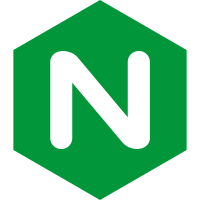

J

### Hi there 👋

- 🔭 I’m currently studing in 🎓**SEU**🎓
- 🌱 I’m currently learning **Knowlege Graph**
- 😁 I’m also familiar with **Frontend FullStack Programing**
- ⚡ Interests and Hobbies: 🛹**skateboard**🛹 🛫**travelling**🛫
- 📫 How to reach me: *my homepage is under developing*, *coming soon*

### Skills

	
	
	
	
	
	
    
    
    
    
    
    
	
	
	
	
	
    
    
    
	
    
    

